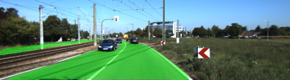
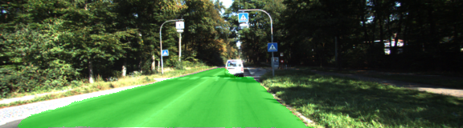
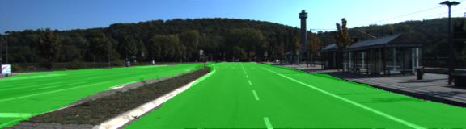

# Semantic Segmentation
### Introduction
This project implements a Fully Convolutional Network (FCN) for scene understanding. It learns to classify road and not road for each pixel in a picture and the algorithm is implemented using Tensorlfow deployed on AWS.

### Architecture

The FCN is composed of two parts, the encoder part which is a convolutional network that functions as a classifier and a decoder part that upsamples the results to the original image size. A Fully Convolutional Network (FCN-8 Architecture developed at Berkeley, see paper [Fully Convolutional Networks for Semantic Segmentation](https://people.eecs.berkeley.edu/~jonlong/long_shelhamer_fcn.pdf)) was applied for the project. It uses VGG16 pretrained on ImageNet as an encoder. Decoder is used to upsample features, extracted by the VGG16 model, to the original image size. The decoder is based on transposed convolution layers together with skip layers

### Training
The entire network including any updates to the vgg component on the [Kitti Road dataset](http://www.cvlibs.net/datasets/kitti/eval_road.php) from [here](http://www.cvlibs.net/download.php?file=data_road.zip). A batch size of 10 image was used for 50 epochs. No image augmentation was used and might help however, the FCN paper above suggest it would not help dramatically. Final mean loss was about .029.


### Results
Here are some of results. The algorithm is able to segment between road and not road for msot of the part in an image






### Setup
##### Frameworks and Packages
Make sure you have the following is installed:
 - [Python 3](https://www.python.org/)
 - [TensorFlow](https://www.tensorflow.org/)
 - [NumPy](http://www.numpy.org/)
 - [SciPy](https://www.scipy.org/)
##### Dataset
Download the [Kitti Road dataset](http://www.cvlibs.net/datasets/kitti/eval_road.php) from [here](http://www.cvlibs.net/download.php?file=data_road.zip).  Extract the dataset in the `data` folder.  This will create the folder `data_road` with all the training a test images.

### Start
##### Implement
Implement the code in the `main.py` module indicated by the "TODO" comments.
The comments indicated with "OPTIONAL" tag are not required to complete.
##### Run
Run the following command to run the project:
```
python main.py
```
**Note** If running this in Jupyter Notebook system messages, such as those regarding test status, may appear in the terminal rather than the notebook.

### Submission
1. Ensure you've passed all the unit tests.
2. Ensure you pass all points on [the rubric](https://review.udacity.com/#!/rubrics/989/view).
3. Submit the following in a zip file.
 - `helper.py`
 - `main.py`
 - `project_tests.py`
 - Newest inference images from `runs` folder  (**all images from the most recent run**)
 
 ## How to write a README
A well written README file can enhance your project and portfolio.  Develop your abilities to create professional README files by completing [this free course](https://www.udacity.com/course/writing-readmes--ud777).
